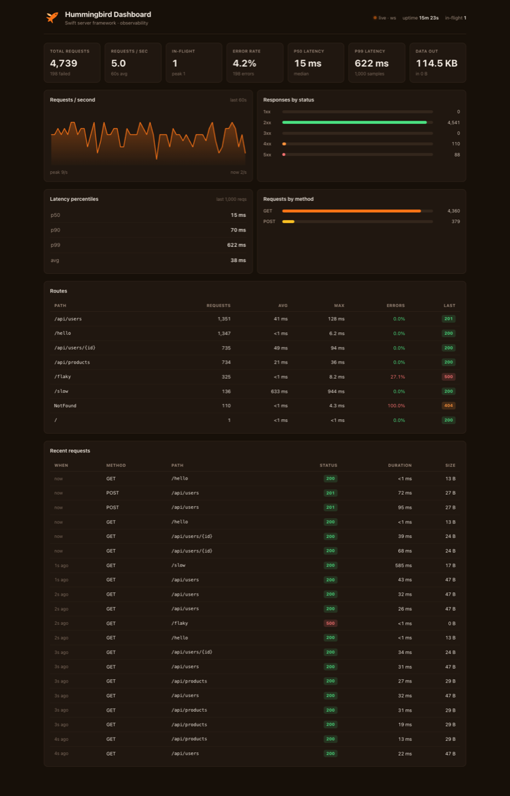

# Hummingbird Dashboard

A drop-in observability dashboard for [Hummingbird](https://github.com/hummingbird-project/hummingbird) servers.

Add middleware and a few routes to your app, then open `/dashboard` in a browser to watch request traffic, latency, and errors in real time. Metrics stay inside your process — no Redis, sidecar, or separate dashboard service required.



## What you get

Once wired up, your Hummingbird app serves:

- **`/dashboard`** — a web UI with request rate charts, latency percentiles, status/method breakdowns, per-route statistics, and a recent-requests feed
- **`/dashboard/api/metrics`** — the same data as JSON for scripts or custom tooling
- **`/metrics`** — Prometheus exposition format for scraping with Prometheus or Grafana
- **`/dashboard/api/live`** *(optional)* — a WebSocket stream that pushes metric snapshots to the UI

The UI updates over WebSocket when available (**live · ws** in the header), and falls back to polling the JSON API every two seconds if the socket is unavailable.

Metrics are collected in memory inside your server process. They reset on restart; use the Prometheus endpoint if you need history beyond the current process lifetime.

## Getting started

1. Add `HummingbirdDashboard` (and optionally `HummingbirdDashboardWS`) to your `Package.swift`
2. Register dashboard routes on your router
3. Add `DashboardMiddleware()` so incoming requests are recorded
4. Run the app and open `/dashboard`

Register dashboard routes **before** the middleware so the dashboard's own traffic is not counted in the metrics it displays:

```swift
router.addDashboard()                         // first
router.add(middleware: DashboardMiddleware()) // then middleware
// ... your routes ...
```

### Try the demo

```sh
cd hummingbird-dashboard
swift run DashboardExample
```

Open [http://localhost:8080/dashboard](http://localhost:8080/dashboard). The example runs a built-in traffic simulator so metrics appear immediately.

If port 8080 is in use:

```sh
SERVER_PORT=8099 swift run DashboardExample
```

### Polling only

Depends on Hummingbird only. The UI polls `/dashboard/api/metrics` on a timer.

```swift
import Hummingbird
import HummingbirdDashboard

let router = Router()
router.addDashboard()
router.add(middleware: DashboardMiddleware())
// ... your routes ...

let app = Application(router: router)
try await app.runService()
```

### WebSocket live updates

Adds push updates via [hummingbird-websocket](https://github.com/hummingbird-project/hummingbird-websocket). Requires a WebSocket-capable router context and server configuration.

```swift
import Hummingbird
import HummingbirdDashboard
import HummingbirdDashboardWS
import HummingbirdWebSocket

let router = Router(context: BasicWebSocketRequestContext.self)
router.addDashboardWithLiveUpdates()
router.add(middleware: DashboardMiddleware())
// ... your routes ...

let app = Application(
    router: router,
    server: .http1WebSocketUpgrade(webSocketRouter: router)
)
try await app.runService()
```

## When to use it

- **Local development** — see which routes are slow, failing, or getting unexpected traffic
- **Demos and staging** — give teammates or stakeholders a live view without standing up Grafana
- **Small services** — enough visibility for day-to-day operations without a full observability stack

For production alerting and long-term retention, scrape `/metrics` into Prometheus or Grafana alongside (or instead of) using the built-in UI.

## Products

| Product | Description |
|---|---|
| **`HummingbirdDashboard`** | Metrics middleware, in-memory store, HTML UI, JSON API, and Prometheus export. Depends on Hummingbird only. |
| **`HummingbirdDashboardWS`** | Everything above plus a WebSocket endpoint for live push updates. Depends on `HummingbirdDashboard` and `HummingbirdWebSocket`. |

## Endpoints

All paths are configurable via `DashboardConfiguration`.

| Route | Description |
|---|---|
| `GET /dashboard` | Dashboard HTML page |
| `GET /dashboard/api/metrics` | Full metrics snapshot as JSON |
| `GET /dashboard/api/health` | Lightweight health check |
| `GET /dashboard/api/live` | WebSocket live metrics stream (`HummingbirdDashboardWS` only) |
| `POST /dashboard/api/reset` | Reset all metrics (opt-in via `enableReset`; shows a **Reset** button in the UI) |
| `GET /metrics` | Prometheus exposition format |

## Configuration

```swift
router.addDashboard(configuration: .init(
    path: "/dashboard",              // dashboard HTML + API base path
    prometheusPath: "/metrics",      // set to nil to disable Prometheus
    enableReset: false,              // true adds POST /dashboard/api/reset + UI button
    refreshIntervalMS: 2000,         // poll / push interval for the UI
    liveSocketPath: nil              // set automatically by addDashboardWithLiveUpdates()
))
```

Use a shared metrics instance when you need a custom store instead of `.shared`:

```swift
let metrics = DashboardMetrics()
router.addDashboard(metrics: metrics)
router.add(middleware: DashboardMiddleware(metrics: metrics))
```

## How it works

```
  Browser                         Your Hummingbird app
  ───────                         ────────────────────

  GET /dashboard        ────────► Dashboard routes (HTML, JSON, Prometheus)
  WS  /dashboard/api/live  ─────► Optional WebSocket push (HummingbirdDashboardWS)

  GET /hello            ────────► DashboardMiddleware
  GET /api/users/{id}   ────────► records timing, status, bytes, route template
                          ────────► DashboardMetrics (thread-safe, in-memory)
```

**`DashboardMiddleware`** wraps your handlers and records each completed request: method, status, duration, bytes in/out, and the route template from `context.endpointPath` (so `/api/users/1` and `/api/users/2` aggregate as `/api/users/{id}`).

**`DashboardMetrics`** stores counters, a 60-second RPS history, latency samples (last 1,000 requests for percentile calculation), per-route stats (up to 200 routes), and a rolling recent-requests feed.

**Dashboard routes** read from the same metrics store the middleware writes to and expose the HTML page, JSON snapshot, Prometheus text, and optional WebSocket stream.

## Requirements

- Swift 6.1+
- Hummingbird 2.x
- **Apple:** macOS 14+ / iOS 17+ / tvOS 17+ (minimum deployment targets in `Package.swift`)
- **Linux:** supported — Swift Package Manager builds on Linux by default; the core library uses no Apple-only APIs

## Local development (this fork)

This package lives at `hummingbird-dashboard/` inside [rogerneal/hummingbird](https://github.com/rogerneal/hummingbird) and depends on the parent fork via `.package(path: "..")` in `Package.swift`.

When extracted to its own repository, replace that with:

```swift
.package(url: "https://github.com/hummingbird-project/hummingbird.git", from: "2.24.0")
```

## Testing

```sh
cd hummingbird-dashboard
swift test
```

Covers metrics recording, route template grouping, Prometheus export, end-to-end HTTP, WebSocket streaming, and reset UI behavior.

## Production use

- Protect `/dashboard` with auth middleware or serve it on an internal-only interface — it exposes routes, error rates, and recent requests.
- Leave `enableReset` disabled (the default) outside development; it registers an unauthenticated endpoint that clears all metrics.
- Scrape `/metrics` with Prometheus for persistence and alerting across restarts and replicas.

## License

Apache-2.0 — see [LICENSE.txt](LICENSE.txt), same as [Hummingbird](https://github.com/hummingbird-project/hummingbird).
